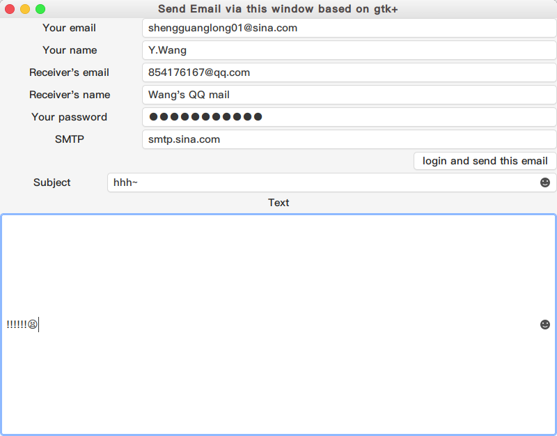

# A simple email program using SMTP and POP

## Developing Environment
* Manjaro Linux 18.0
* Python 3.7.1
* Glade 3.22.1

## Needed Libraries
* If you are using Linux, you just don't need any other libraries.
* If you are using Windows, you should surf the Internet and find how to use GTK+.
* **Python Libraries**
    > email
    
    > smtplib
    
    > poplib
    
## Needed Software
* Glade(https://glade.gnome.org/)
> What is Glade?

> Glade is a RAD tool to enable quick & easy development of user interfaces for the GTK+ toolkit and the GNOME desktop environment.

> The user interfaces designed in Glade are saved as XML, and by using the GtkBuilder GTK+ object these can be loaded by applications dynamically as needed.

> By using GtkBuilder, Glade XML files can be used in numerous programming languages including C, C++, C#, Vala, Java, Perl, Python,and others.

> Glade is Free Software released under the GNU GPL License 

## A Introduction to GTK+
* Introduction

> GTK+, or the GIMP Toolkit, is a multi-platform toolkit for creating graphical user interfaces. Offering a complete set of widgets, GTK+ is suitable for projects ranging from small one-off tools to complete application suites.

* Website:
> https://www.gtk.org/

* Develop with python
> This tutorial gives an introduction to writing GTK+ 3 applications in Python.

> Prior to working through this tutorial, it is recommended that you have a reasonable grasp of the Python programming language. GUI programming introduces new problems compared to interacting with the standard output (console / terminal). It is necessary for you to know how to create and run Python files, understand basic interpreter errors, and work with strings, integers, floats and Boolean values. For the more advanced widgets in this tutorial, good knowledge of lists and tuples will be needed.

> Although this tutorial describes the most important classes and methods within GTK+ 3, it is not supposed to serve as an API reference. Please refer to the GTK+ 3 Reference Manual for a detailed description of the API. Also there’s a Python-specific reference available.

* Website
> https://python-gtk-3-tutorial.readthedocs.io/en/latest/
## How to use it
* Via Console

    **Just following tips is ok.**
    
    **demo**
    
* Via GUI
    
    **Fill all you can fill with**
    
 
## Description

There are some functions in my programme.
* **def _format_addr(self, s)**
    
    This is used to format the address string.

* **def set_details(self, from_addr, password, to_addr, smtp_server, from_name, to_name, message, subject)**

    This function is used to set all the information needed to send a message.

* **def login_and_send(self)**

    This function is used to connect to the SMTP sending server and log in to the account and send the mail.
    
## Key Codes
* Set details
    ```
    def set_details(self, from_addr, password, to_addr, smtp_server, from_name, to_name, message, subject):
        self.from_addr = from_addr
        self.password = password
        self.to_addr = to_addr
        self.smtp_server = smtp_server

        msg = MIMEText(message, 'plain', 'utf-8')
        msg['From'] = self._format_addr((from_name + ' <%s>') % self.from_addr)
        msg['To'] = self._format_addr((to_name + ' <%s>') % self.to_addr)
        msg['Subject'] = Header(subject, 'utf-8').encode()

        self.msg = msg
    ```
* Login and send
    ```
    def login_and_send(self):
        server = smtplib.SMTP(self.smtp_server, 25)
        server.set_debuglevel(1)
        server.login(self.from_addr, self.password)
        server.sendmail(self.from_addr, [self.to_addr], self.msg.as_string())
        server.quit()
    ```

# References
* Michael Liao's GitHub
> https://github.com/michaelliao/learn-python3/tree/master/samples/mail

* Michael Liao's Wiki
> https://www.liaoxuefeng.com/wiki/0014316089557264a6b348958f449949df42a6d3a2e542c000/001432005226355aadb8d4b2f3f42f6b1d6f2c5bd8d5263000

> https://www.liaoxuefeng.com/wiki/0014316089557264a6b348958f449949df42a6d3a2e542c000/0014320098721191b70a2cf7b5441deb01595edd8147196000

* GTK+ Official site
> https://www.gtk.org/

* The Python GTK+ 3 Tutorial
> https://python-gtk-3-tutorial.readthedocs.io/en/latest/

* AlicFeng's Study Python For Gtk3
> https://www.jianshu.com/p/6bd022b59687